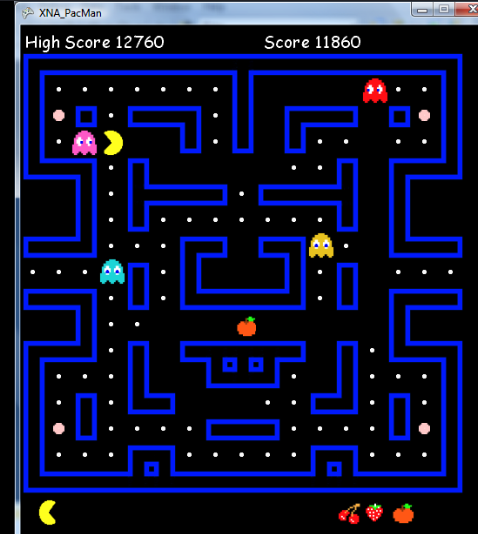

# Godot PacMan Clone

Project to test engine familiarity and learn a few new things.

Tile Units based on screen shot: 17 X 17 (add a 1 tile border around the whole play area, 19X19)

tile size 44X44, * 18:

Resolution: 836X836

## Systems

### Root Scene Options

- Main Menu
- Options
- Level 1
- Act 2 CutScene
- Level 2
- Win CutScene

### Scenes

- HUD
    - Score
    - Lives Left
    - Fruit
    - Game Updates
- Player Character
- Enemy Character
- Pellet
- Attack Pellet
- Fruit
- Pause Menu
- Fade Screen

## Notes:

remake wall tiles to be smaller visually but make collision shape the full
44. this way characters can be 44 and have the space needed to move.
